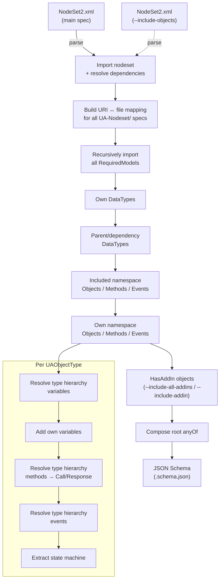

# opcua-schemagen

Generate JSON Schema from OPC UA nodesets/companion specifications for MQTT app-to-app scenarios.

The repository, Python package, and CLI are named `opcua-schemagen`. The import package is `opcua_schemagen`.

## Requirements

* Python >= 3.14
* [uv](https://docs.astral.sh/uv/)

## Setup

```
git submodule update --init
uv sync
```

## Usage

All commands operate on a spec path relative to `UA-Nodeset/`.

```
# List all available nodesets
uv run opcua-schemagen index

# Show nodeset metadata (namespaces, required models, aliases)
uv run opcua-schemagen info ISA95-JOBCONTROL

# List UAObjectType nodes and their children
uv run opcua-schemagen objects ISA95-JOBCONTROL

# List UADataType nodes
uv run opcua-schemagen types ISA95-JOBCONTROL

# Generate JSON Schema (main command)
uv run opcua-schemagen appschema Machinery/Jobs machinery_jobs.schema.json --nodeid-replace "ns=2;i=1002->ns=2;i=1008"

# Include all HasAddIn objects (e.g. Identification, Monitoring, LifetimeCounters, ...)
uv run opcua-schemagen appschema IJT/Tightening ijt_tightening.schema.json --include-objects IJT/Base --include-all-addins

# Include only specific addin types by their TypeDefinition display name
uv run opcua-schemagen appschema IJT/Tightening ijt_tightening.schema.json --include-objects IJT/Base \
  --include-addin MachineryItemIdentificationType \
  --include-addin MonitoringType
```

> Note: `--nodeid-replace` is needed to activate sub state machines when node IDs require patching.
> Note: `--include-objects` includes objects/methods/events from a parent spec that the main spec extends but doesn't redefine.
> Note: `--include-all-addins` includes all objects referenced via `HasAddIn` from every processed `UAObjectType`. Use `--include-addin <TypeName>` (repeatable) to include only addins whose `HasTypeDefinition` display name matches.

## Overall Design

To achieve a modern and standards based application architecture for manufacturing control apps the established and well-defined OPC UA companion specs are used as APIs for the shopfloor.

### Design Goals

* Manufacturing control/OT apps should be buildable like IT applications with cloud native/modern architecture principles
* Code is generated as much as possible from the OPC UA specs to lower the burden to adhere to the standards
* The tool approach MUST work for [OPC 40001-3: Machinery Job Mgmt](https://reference.opcfoundation.org/Machinery/Jobs/v100/docs/)/[OPC 10031-4: ISA-95-4 Job Control](https://reference.opcfoundation.org/ISA95JOBCONTROL/v200/docs/) spec, SHOULD work also for others like Tightening, etc.

### JSON Schema Generation

#### Overall Flow



#### Details

* Nodeset parsing via `opcua-asyncio` XMLParser from `FreeOpcUa`
* All `RequiredModel` entries in a nodeset are recursively imported, so the full dependency tree is available (e.g. DI, Machinery, IA, Machinery/Result for IJT)
* Generate datatypes from nodeset(s) including base UADataTypes
* Generate a 'DataSet' for every UAObjectType with all variables added from the type hierarchy
* Generate 'Method' for every Input-/OutputArgument per UAMethod (split into Call/Response pairs)
* Generate 'Event' for every UAEvent referenced via `GeneratesEvent`
* OPC UA placeholder variables (`OptionalPlaceholder`, `MandatoryPlaceholder` modelling rules) are skipped — these are template slots, not concrete properties
* root `anyOf` contains all non-datatype objects (DataSets, Methods, Events)
* Custom attributes:
  * `x-opc-ua-type` to distinguish: "DataSet", "Method", "Event"
  * `x-opc-ua-state-machine` with extracted state machine states and transitions
  * `x-cloudevent-type` / `x-cloudevent-dataschema` for CloudEvents integration

#### Inheritance / Processing Order

* Own DataTypes are processed first and take precedence over parent definitions (first-wins via duplicate guard)
* Parent/dependency DataTypes fill in anything the own namespace didn't define
* When `--include-objects` is used, included namespace objects are processed before own namespace objects, so the own spec can override parent properties
* When `--include-all-addins` or `--include-addin` is used, `HasAddIn` child objects of each processed `UAObjectType` are included as additional DataSet definitions; their variables, methods, and events are resolved the same way as regular component objects. `--include-addin` filters by the display name of the addin's `HasTypeDefinition` type node
* Type hierarchy is walked recursively for variables, methods, events, and state machines — parent types contribute their members, child types overwrite

#### Why `--include-objects`?

Some OPC UA companion specs split their model across multiple nodesets. For example, IJT/Tightening only defines a single abstract interface (`ITighteningToolParametersType`) while all concrete objects (JoiningSystemType, health, maintenance, results, asset management) live in IJT/Base. Without `--include-objects IJT/Base`, the generated schema would contain only DataTypes and no usable objects. Auto-detecting which dependencies are "domain parents" vs "infrastructure" (DI, Machinery) is not reliable, so inclusion is explicit.

Links:
* https://github.com/FreeOpcUa/opcua-asyncio/blob/master/asyncua/common/xmlparser.py

### Annoyances

* Nodesets overall:
  * do not contain the spec's title
* Machinery JobMgmt Nodeset:
  * does not contain method's return status
  * does not contain the full state machine
* IJT Tightening Nodeset:
  * concrete objects live entirely in IJT/Base, Tightening only adds one abstract interface — requires `--include-objects` to produce a useful schema
  * addin objects (Identification, LifetimeCounters, Monitoring, Notifications, OperationCounters) are defined via `HasAddIn` references in IJT/Base — requires `--include-all-addins` (or targeted `--include-addin`) to include them in the schema

## Python Libs

* https://github.com/fastapi/typer
* https://github.com/FreeOpcUa/opcua-asyncio/
* https://github.com/Textualize/rich
* https://github.com/koxudaxi/datamodel-code-generator

## Notes

### Links

* https://json-schema.org/learn // https://json-schema.org/draft/2020-12/json-schema-core
* https://www.unified-automation.com/de/produkte/entwicklerwerkzeuge/uaexpert.html
* https://prosysopc.com/products/opc-ua-browser/
* https://dev.to/somedood/bitmasks-a-very-esoteric-and-impractical-way-of-managing-booleans-1hlf

### uv

```
uv lock --upgrade
```

### Add submodule for nodeset repo

https://miroslav-slapka.medium.com/handle-git-submodules-with-ease-55621afdb7bb

```
git submodule add -b latest https://github.com/OPCFoundation/UA-Nodeset.git
```
