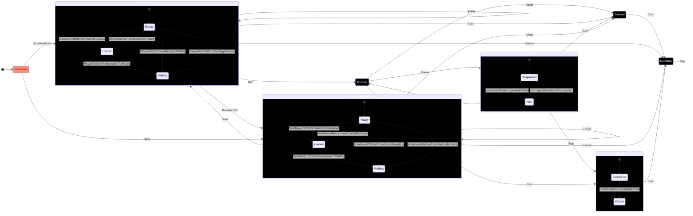

# JobOrderControl State Machine

```mermaid
---
State Machine
---
stateDiagram-v2
  direction LR
  classDef s_default fill:black,color:white
  classDef s_inactive fill:white,color:black
  classDef s_parallel color:black,fill:white
  classDef s_active color:red,fill:darksalmon
  classDef s_previous color:blue,fill:azure
  
  state "Aborted" as Aborted
  Class Aborted s_default
  state "AllowedToStart" as AllowedToStart
  Class AllowedToStart s_default
  state AllowedToStart {
    [*] --> AllowedToStart_Ready
    state "Loaded" as AllowedToStart_Loaded
    state "Ready" as AllowedToStart_Ready
    state "Waiting" as AllowedToStart_Waiting
  }
  state "Ended" as Ended
  Class Ended s_default
  state Ended {
    [*] --> Ended_Completed
    state "Closed" as Ended_Closed
    state "Completed" as Ended_Completed
  }
  state "Interrupted" as Interrupted
  Class Interrupted s_default
  state Interrupted {
    [*] --> Interrupted_Suspended
    state "Held" as Interrupted_Held
    state "Suspended" as Interrupted_Suspended
  }
  state "NotAllowedToStart" as NotAllowedToStart
  Class NotAllowedToStart s_default
  state NotAllowedToStart {
    [*] --> NotAllowedToStart_Ready
    state "Loaded" as NotAllowedToStart_Loaded
    state "Ready" as NotAllowedToStart_Ready
    state "Waiting" as NotAllowedToStart_Waiting
  }
  state "Running" as Running
  Class Running s_default
  state "InitialState" as InitialState
  Class InitialState s_active
  state "EndState" as EndState
  EndState --> [*]
  Class EndState s_default
  
  AllowedToStart --> Aborted: Abort
  AllowedToStart --> AllowedToStart: Update
  AllowedToStart --> NotAllowedToStart: RevokeStart
  AllowedToStart --> Running: Run
  AllowedToStart --> EndState: Cancel
  Interrupted --> Aborted: Abort
  Interrupted --> Ended: Stop
  Interrupted --> Running: Resume
  NotAllowedToStart --> Aborted: Abort
  NotAllowedToStart --> NotAllowedToStart: Update
  NotAllowedToStart --> AllowedToStart: Start
  NotAllowedToStart --> EndState: Cancel
  Running --> Aborted: Abort
  Running --> Ended: Stop
  Running --> Interrupted: Pause
  InitialState --> NotAllowedToStart: Store
  InitialState --> AllowedToStart: StoreAndStart
  Aborted --> EndState: Clear
  Ended --> EndState: Clear
  AllowedToStart_Loaded --> AllowedToStart_Ready: AllowedToStartFromLoadedToReady
  AllowedToStart_Loaded --> AllowedToStart_Waiting: AllowedToStartFromLoadedToWaiting
  AllowedToStart_Ready --> AllowedToStart_Loaded: AllowedToStartFromReadyToLoaded
  AllowedToStart_Ready --> AllowedToStart_Waiting: AllowedToStartFromReadyToWaiting
  AllowedToStart_Waiting --> AllowedToStart_Ready: AllowedToStartFromWaitingToReady
  Ended_Completed --> Ended_Closed: EndedFromCompletedToClosed
  Interrupted_Held --> Interrupted_Suspended: InterruptedFromHeldToSuspended
  Interrupted_Suspended --> Interrupted_Held: InterruptedFromSuspendedToHeld
  NotAllowedToStart_Loaded --> NotAllowedToStart_Ready: NotAllowedToStartFromLoadedToReady
  NotAllowedToStart_Loaded --> NotAllowedToStart_Waiting: NotAllowedToStartFromLoadedToWaiting
  NotAllowedToStart_Ready --> NotAllowedToStart_Loaded: NotAllowedToStartFromReadyToLoaded
  NotAllowedToStart_Ready --> NotAllowedToStart_Waiting: NotAllowedToStartFromReadyToWaiting
  NotAllowedToStart_Waiting --> NotAllowedToStart_Ready: NotAllowedToStartFromWaitingToReady
  [*] --> InitialState
```
